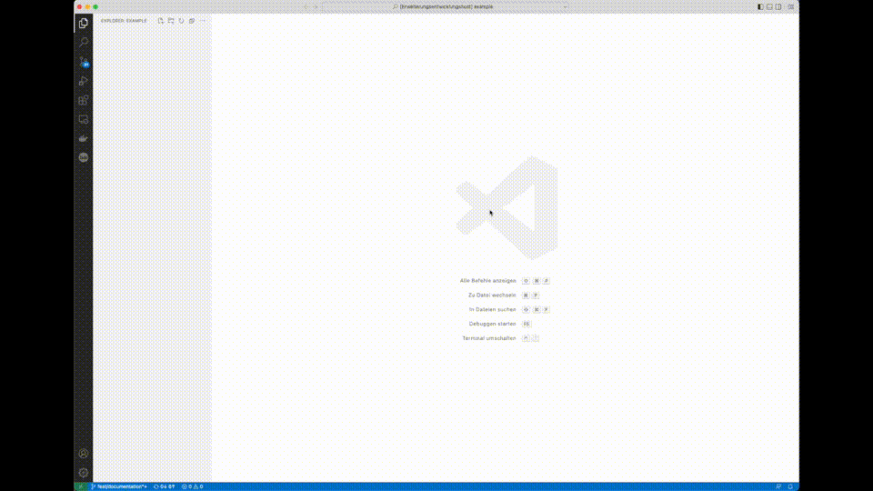
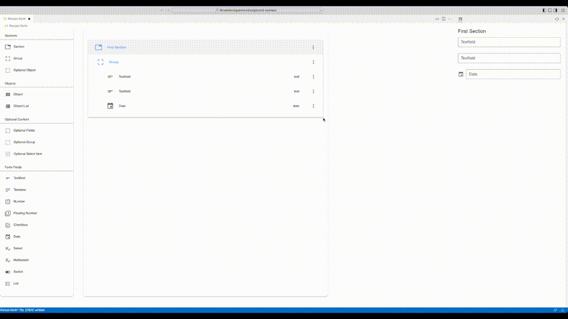

<!-- PROJECT SHIELDS -->
[![Contributors][contributors-shield]][contributors-url]
[![Forks][forks-shield]][forks-url]
[![Stargazers][stars-shield]][stars-url]
[![Issues][issues-shield]][issues-url]
[![MIT License][license-shield]][license-url]
<!-- END OF PROJECT SHIELDS -->

<!-- PROJECT LOGO -->
 

  

<h3 align="center"><i>miranum-vs-code-forms</i></h3>

  

    <i></i>
     <a href="https://github.com/FlowSquad/miranum-vs-code-forms/issues">Report Bug</a>
    ·
    <a href="https://github.com/FlowSquad/miranum-vs-code-forms/issues">Request Feature</a>
  

<!-- ABOUT THE PROJECT -->
## About The Project

Display and edit forms in VS Code using [DigiWF Form Builder](https://github.com/it-at-m/digiwf-core/tree/dev/digiwf-apps/packages/components/digiwf-form-builder) and
[DigiWF Form Renderer](https://github.com/it-at-m/digiwf-core/tree/dev/digiwf-apps/packages/components/digiwf-form-renderer).

(<a href="#top">back to top</a>)

### Built With

The documentation project is built with technologies we use in our projects:

* [TypeScript](https://www.typescriptlang.org/)
* [VS Code API](https://code.visualstudio.com/api/references/vscode-api)
* [Vue.js](https://vuejs.org/)

(<a href="#top">back to top</a>)

## Features

* Modify `.form`-Files in a Modeler using Drag and Drop
  * if necessary use the `VS Code` standard text editor to apply changes
* View your changes live in a separate preview
* Save your changes to a local file

(<a href="#top">back to top</a>)

## Getting started

For an explanation on how to get started, please refer to [our website](https://www.miranum.io/docs/gettingstarted).

(<a href="#top">back to top</a>)

## Documentation

For all further documentation, please refer to the [documentations doc](docs/extension/documentation.md).

(<a href="#top">back to top</a>)

(<a href="#top">back to top</a>)

<!-- CONTRIBUTING -->
## Contributing

Contributions are what make the open source community such an amazing place to learn, inspire, and create. Any contributions you make are **greatly appreciated**.

If you have a suggestion that would make this better, please open an issue with the tag "enhancement", fork the repo and create a pull request. You can also simply open an issue with the tag "enhancement".
Don't forget to give the project a star! Thanks again!

1. Open an issue with the tag "enhancement"
2. Fork the Project
3. Create your Feature Branch (`git checkout -b feature/AmazingFeature`)
4. Commit your Changes (`git commit -m 'Add some AmazingFeature'`)
5. Push to the Branch (`git push origin feature/AmazingFeature`)
6. Open a Pull Request

More about this in the [CODE_OF_CONDUCT](/CODE_OF_CONDUCT.md) file.

(<a href="#top">back to top</a>)

## License

Distributed under the Apache License Version 2.0. See [`License`](LICENSE) file for mor information.

(<a href="#top">back to top</a>)

<!-- MARKDOWN LINKS & IMAGES -->
<!-- https://www.markdownguide.org/basic-syntax/#reference-style-links -->
[contributors-shield]: https://img.shields.io/github/contributors/FlowSquad/vs-code-vuetify-jsonschema-builder.svg?style=for-the-badge

[contributors-url]: https://github.com/FlowSquad/miranum-vs-code-forms/graphs/contributors

[forks-shield]: https://img.shields.io/github/forks/FlowSquad/vs-code-vuetify-jsonschema-builder.svg?style=for-the-badge

[forks-url]: https://github.com/FlowSquad/miranum-vs-code-forms/network/members

[stars-shield]: https://img.shields.io/github/stars/FlowSquad/vs-code-vuetify-jsonschema-builder.svg?style=for-the-badge

[stars-url]: https://github.com/FlowSquad/miranum-vs-code-forms/stargazers

[issues-shield]: https://img.shields.io/github/issues/FlowSquad/vs-code-vuetify-jsonschema-builder.svg?style=for-the-badge

[issues-url]: https://github.com/FlowSquad/miranum-vs-code-forms/issues

[license-shield]: https://img.shields.io/github/license/FlowSquad/vs-code-vuetify-jsonschema-builder.svg?style=for-the-badge

[license-url]: https://github.com/FlowSquad/miranum-vs-code-forms/blob/develop/LICENSE
